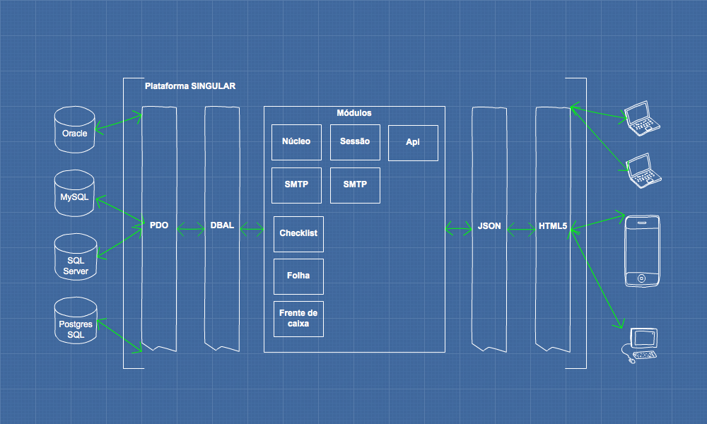

# Plataforma Singular

## O que é

A __Plataforma Singular__ é um plataforma completa para a criação rápida de __Intranets__ e __Aplicativos web/mobile__
construída sobre componentes e tecnologias opensource reconhecidos como padrão internacional no mercado de desenvolvimento.

## Tecnologias

| Tecnologia | Descrição | Link
|------------|-----------|------
| PHP | Linguagem de Desenvolvimento Web altamente difundida e utilizada na comunidade | [http://www.php.net](http://www.php.net)
| Symfony Components | Bibliotecas de componentes de código para reutilização na linguagem PHP | [http://symfony.com](http://symfony.com/components)
| HTML5 | Última versão da linguagem para estruturação e apresentação de conteúdo para a World Wide Web | [W3C HTML5](https://www.w3.org/TR/html5/)
| CSS3 | Última versão da linguagem de definição de estilos para páginas de conteúdo World Wide Web | [W3C CSS3](https://www.w3.org/TR/CSS/)
| MySQL | Sistema de Gerenciamento de Banco de Dados Robusto utilizado por plataformas como Uber | [Site Oficial](https://www.mysql.com/)
| PDO DBAL| Módulo PHP que disponibiliza uma camada de abstração para acesso a diversos SGBD de forma transparente | [PHP PDO](http://php.net/manual/pt_BR/book.pdo.php)
| JSON | Formato de troca de dados entre cliente e servidor que se tornou padrão em aplicações web | [Site Oficial](http://www.json.org/json-pt.html)
| AngularJS | Mais moderno framework de front-end da atualidade desenvolvido e mantido pela Google Inc | [Angular](https://angularjs.org/)

## Arquitetura

A __Plataforma Singular__ foi desenvolvida utilizando poderosos padrões de projeto como (__Interface__, __Adapter__,
__Proxy__, __Dependency Injector__) dentre outros. A adoção desses padrões tornou possível a criação de uma plataforma
altamente extensível, adaptável e desacoplada.

## Funcionalidades e recursos

+ Módulo de Autenticação integrada com Active Directory opcional;
+ Definição de permissões de acesso às funcionalidades por perfil de usuário;
+ Integração com serviços internos e externos de SMTP para envio de email;
+ Possibilidade de disponibilização de API para integração com aplicativos e dispositivos móveis;
+ Integração com qualquer sistema legado através de WebService ou Conexão direta ao banco de dados com PDO DBAL;
+ Flexibilidade e extensibilidade com a possibilidade de criação de módulos para atender necessidades específicas de
clientes;
+ Alto desempenho sem consumo de recursos excessivos de processamento;